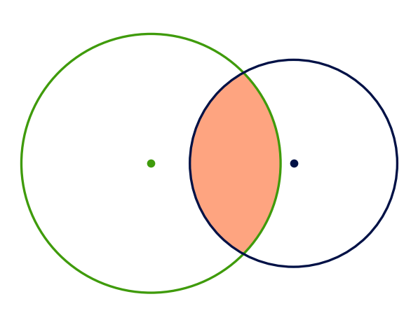
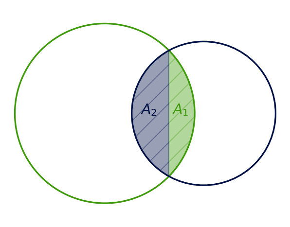
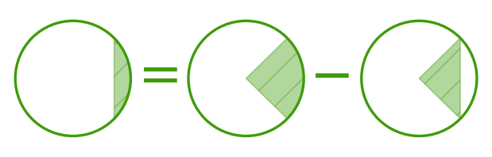
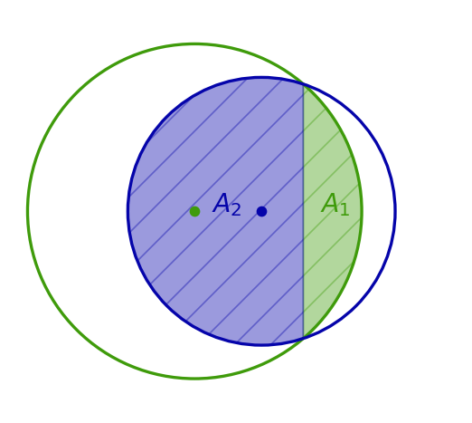
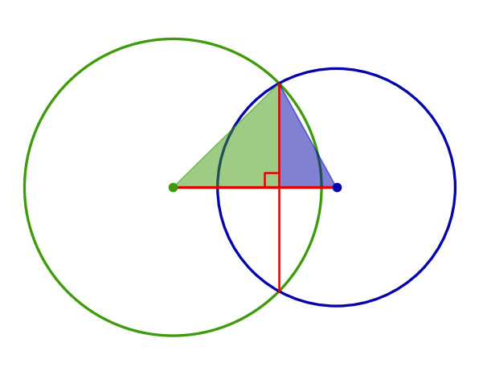
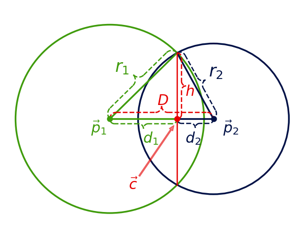

# Introduction
<figure display="table">
  
  <figcaption display="table-caption" caption-side="bottom"><i>Figure 1: Area of intersection shown in orange. </i></figcaption>
</figure>

We look at computing the area of intersection of two circles (see Figure 1). This problem seems like it should be almost trivial. However, there are some corner cases to handle that are not immediately obvious (at least to me). Googling for this has brought me to several partial results that do not account for all the corner cases, so here is hopefully a post that is complete and can be referenced in the future to be able to quickly implement this computation. Hopefully, this post will not <a href="https://xkcd.com/927/" target="_blank"> cause any further confusion</a>.

If you are not interested in the reading everything and just want the formulas, go to the <a href="#summary">summary</a>.

# Computing the Intersection Area

There are some easy corner cases with the intersection of two circles:

1. No intersection area, the circles are too far apart
2. One circle is completely inside the other (coincident circles are a special case of this), thus the intersection area is simply the area of the smaller circle.
3. One intersection point, the circles are touching at one point and have no intersection area.

Finally, there is the "normal" case where the circle edges will intersect at two points as depicted in Figure 1. We can draw the line that contains the two intersection points, which is known as the <a href="https://en.wikipedia.org/wiki/Radical_axis" target="_blank">radical axis</a>. We can then look at computing the intersection areas on either side of the radical axis. A depiction of a possible case is shown in Figure 2.
<figure display="table">
  
  <figcaption display="table-caption" caption-side="bottom"><i>Figure 2: The total area will be the sum of the shaded areas. </i></figcaption>
</figure>

In this particular case, we simply need to compute the areas of the two "caps." Each cap can be computed by subtracting a triangle from the arc area as shown in Figure 3.

<figure display="table">
  
  <figcaption display="table-caption" caption-side="bottom"><i>Figure 3: Cap area = Arc area - Triangle Area </i></figcaption>
</figure>

Just computing the area of the caps will not cover all cases. They represent the intersected area only when the radical axis is "in-between" the two centers of the circles. There is one more case when radical axis is not in-between the two centers of the circles. This can only happen when one circle is smaller than the other and is shown in Figure 4 (this is the case that I see most online sources miss).

<figure display="table">
  
  <figcaption display="table-caption" caption-side="bottom"><i>Figure 4: Radical axis is not in-between the circle centers. </i></figcaption>
</figure>

This case is still easy to deal with, as \\( A_2 \\) in Figure 4 is the "inverse" of the cap: the area of the smaller circle minus the area of the cap. Thus to compute the area of intersection for the case of two intersection points, we simply need to compute the area of the caps (and possibly "invert" them in the case of Figure 4). Thus, there are two cases we look at when determining the intersection area with two intersection points: The case where the radical axis is in-between the two circle centers, and the case where it is not.

To compute the cap area, we need the arc area and triangle area. The arc area can be determined from the length of the chord because it will allow us to obtain the angle of the arc. The triangle area can also be determined by the length of the chord because we then have a base to an isoceles triangle. Thus we will look at computing the area of the chord. A helpful line to draw is the line connecting the two centers of the circles as shown in Figure 5.

<figure display="table">
  
  <figcaption display="table-caption" caption-side="bottom"><i>Figure 5: A helpful line and right triangles. </i></figcaption>
</figure>

It happens to be the case that the radical axis is perpendicular to the line connecting the circle centers <a href="https://artofproblemsolving.com/wiki/index.php/Radical_axis" target="_blank">[Art of Problem Solving: Radical Axis, Theorem 2]</a>. This allows us to form right triangles as shown in Figure 5, where the hypotenuses are the radiuses of the respective circles. We can then use these right triangles to write down some geometric relationships to help us solve for the length of the chord along the radical axis. Before we write these relationships, we will now define some notation for the quantities we have been considering.

#### Notation
<figure display="table">
  
  <figcaption display="table-caption" caption-side="bottom"><i>Figure 6: Notation. </i></figcaption>
</figure>

Figure 6 gives a visual guide to the various geometric quantities we will define. Note that while Figure 6 gives an example of how various geometric quantities can look, the relationships between them can change given depending on whether the radical axis is in-between the two circle centers or not. The quantities are defined as follows:

1. Each circle is defined with a center, \\( \vec{p} = (p_x, p_y)\\), and a radius, \\( r \\). We will subscript these variables to denote either circle 1 or circle 2, e.g. \\( \vec{p}_1\\) is the center of circle 1.
2. The distance between the two centers is defined as \\(D = || \vec{p}_1 - \vec{p}_2||_2\\)
3. The intersection of the radical axis and the line connecting the center of the circles is denoted as \\( \vec{c} \\)
4. The distance between \\(\vec{c} \\) and one of the intersection points is denoted as \\(h\\) (Note that the triangles formed by the points \\(\vec{p}_1\\), \\(\vec{c}\\), and either intersection point is the same. Thus, the quantity, \\(h\\), is the same no matter which intersection point you choose).
5. The distance between \\(\vec{c} \\) and \\(\vec{p}_1\\) is denoted as \\(d_1\\). The distance between \\(\vec{c} \\) and \\(\vec{p}_2\\) is denoted as \\(d_2\\). 

#### The "Normal" Case
Having defined the notation, we can start writing down geometric relationships. From the two right triangles shown in Figure 5, we can write down Pythagorean's theorem

$$ \begin{align}  \color{#3f9b0b}  r_1^2 \color{black} &=  \color{#3f9b0b} d_1^2  \color{black} + \color{red} h^2  \\\\ 
\color{#0504aa} r_2^2 \color{black} &= \color{#0504aa}  d_2^2 \color{black} + \color{red} h^2 \end{align} $$

Next, one of the following equations must be true.

$$ \begin{align} 1) \quad \color{#3f9b0b} d_1 \color{black} + \color{#0504aa} d_2 \color{black} &= \color{red} D \\\\
\color{black} 2) \color{#3f9b0b} \quad d_1 \color{black} + \color{red} D \color{black} &= \color{#0504aa} d_2\\\\ 
\color{black} 3) \color{#0504aa} \quad d_2 \color{black} + \color{red} D \color{black} &= \color{#3f9b0b} d_1 \end{align} $$

1. Case 1 corresponds to when the radical line is inbetween the circle centers as shown in Figure 2.
2. Case 2 corresponds to when the radical line is not in between the circle centers (as shown in Figure 4) and circle 1 is the smaller circle
3. Case 3 is the same as Case 2, but circle 2 is the smaller circle.

Combining the two equations from Pythagorean's theorem and any one of the 3 cases, we get 3 equations and 3 unknowns (\\(\color{#3f9b0b} d_1\\), \\(\color{#0504aa} d_2\\), \\(\color{red} h\\)). For each scenario, we can solve for \\(d_1\\)

$$\begin{align}1) \quad \color{#3f9b0b} d_1 \color{black} &= 
    \frac{\color{#3f9b0b} r_1^2 \color{black} - \color{#0504aa} r_2^2 \color{black} + \color{red} D^2}
      {2\color{red}D} \\\\
  2) \quad  \color{#3f9b0b} d_1 \color{black} &= 
    \frac{\color{#0504aa} r_2^2 \color{black} - \color{#3f9b0b} r_1^2 \color{black} - \color{red} D^2}
      {2\color{red}D} \\\\
  3) \quad  \color{#3f9b0b} d_1 \color{black} &= 
    \frac{\color{#3f9b0b} r_1^2 \color{black} - \color{#0504aa} r_2^2 \color{black} - \color{red} D^2 \color{black} + 2\color{red}D}
      {2\color{red}D} \\\\
\end{align}$$

And then, solve for \\(\color{red}h \\)
$$ \color{red}h \color{black} = \sqrt{\color{#3f9b0b}r_1^2 \color{black} - \color{#3f9b0b} d_1^2}$$

Now, we can find the area for the caps as shown in Figure 3. For circle 1, we have
$$ \begin{align}
Cap Area &= Arc Area \quad &- \quad&Triangle Area\\\\
&= \color{#3f9b0b} r_1^2\color{black} \arcsin(\frac{\color{red}h}{\color{#3f9b0b}r_1}) &- \quad&\color{red}h \color{#3f9b0b}d_1
\end{align}$$
Circle two is the same but with \\(r_2\\) and \\(d_2\\).

To check if any of the caps have to be inverted, we can compute \\(\color{#3f9b0b}d_1\\) for the scenarios where the radial axis is not in between the circle centers. If they are not, then the value will be positive. 
With this, we can now compute the intersection area.

<h1 id="summary"> Summary </h1>

This section will be a succint summary of all the equations and conditions required to compute intersection area with no explanation. We use the notation introduced in Figure 6. 

$$\color{red}D \color{black} = || \color{#3f9b0b} \vec{p}_1 \color{black} - \color{#0504aa} \vec{p}_2 \color{black} ||_2$$

$$\color{#3f9b0b} d_{1}^{(center)} \color{black} = 
    \frac{\color{#3f9b0b} r_1^2 \color{black} - \color{#0504aa} r_2^2 \color{black} + \color{red} D^2}
      {2\color{red}D}, 
 %
 \quad \color{#0504aa} d_2^{(center)} \color{black} = \color{red} D\color{black} - \color{#3f9b0b} d_{1}^{(center)}, 
 %
 \quad\color{red} h^{(center)} \color{black} = \sqrt{\color{#3f9b0b} r_1^2 \color{black} - \color{#3f9b0b} {d_1^{(center)}}^2\color{black}}$$

$$ \color{#3f9b0b} d_{1}^{(circle1)} \color{black} = 
    \frac{\color{#0504aa} r_2^2 \color{black} - \color{#3f9b0b} r_1^2 \color{black} - \color{red} D^2}
      {2\color{red}D}, 
%
 \quad \color{#0504aa} d_2^{(circle1)} \color{black} = \color{red} D\color{black} + \color{#3f9b0b} d_{1}^{(circle1)}
%
\quad \color{red} h^{(circle1)} \color{black} = \sqrt{\color{#3f9b0b} r_1^2 \color{black} - \color{#3f9b0b} {d_1^{(circle1)}}^2\color{black}} $$

$$ \color{#0504aa} d_{2}^{(circle2)} \color{black} = 
    \frac{\color{#3f9b0b} r_1^2 \color{black} - \color{#0504aa} r_2^2 \color{black} - \color{red} D^2 \color{black}}
      {2\color{red}D}, 
%
 \quad \color{#3f9b0b} d_1^{(circle2)} \color{black} = \color{red} D \color{black} + \color{#0504aa} d_{2}^{(circle2)} \color{black},
 %
\quad \color{red} h^{(circle2)} \color{black} = \sqrt{\color{#3f9b0b} r_1^2 \color{black} - \color{#3f9b0b} {d_1^{(circle2)}}^2\color{black}}$$

$$
IntersectionArea(\color{#3f9b0b}\vec{p}_1\color{black}, \color{#3f9b0b}r_1\color{black}, \color{#0504aa}\vec{p}_2\color{black}, \color{#0504aa}r_2\color{black}) = 
\begin{cases}
% no intersection
0, & \text{if } \color{red} D \color{black} > \color{#3f9b0b} r_1 + \color{#0504aa} r_2\\\\
% circle1 in circle2
\pi  \color{#3f9b0b} r_1^2 & \text{if } \color{red} D \color{black} + \color{#3f9b0b} r_1 \leq \color{#0504aa} r_2\\\\
% circle2 in circle1
\pi  \color{#0504aa} r_2^2 & \text{if } \color{red} D \color{black} + \color{#0504aa} r_2 \leq \color{#3f9b0b} r_1 \\\\
  % normal case smaller circle1
\pi \color{#3f9b0b} r_1^2 \color{black} - (\color{#3f9b0b} r_1^2 \color{black} \arcsin(\frac{\color{red}h^{(circle1)}\color{black}}{\color{#3f9b0b}r_1\color{black}}) - \color{red}h^{(circle1)} \color{#3f9b0b}d_1^{(circle1)} \color{black}) + \\\\ \qquad 
  \color{#0504aa} r_2^2 \color{black} \arcsin(\frac{\color{red}h^{(circle1)}\color{black}}{\color{#0504aa}r_2\color{black}}) - \color{red}h^{(circle1)}\color{black} \color{#0504aa}d_2^{(circle1)} \color{black}
  & \text{if } \color{#3f9b0b} d_1^{(circle1)} \color{black} \geq 0 \\\\
  % normal case smaller circle2
\color{#3f9b0b} r_1^2 \color{black} \arcsin(\frac{\color{red}h^{(circle2)}\color{black}}{\color{#3f9b0b}r_1\color{black}}) - \color{red}h^{(circle2)} \color{#3f9b0b}d_1^{(circle2)} \color{black} + \\\\ \qquad
  \pi \color{#0504aa} r_2^2 \color{black} - (
  \color{#0504aa} r_2^2 \color{black} \arcsin(\frac{\color{red}h^{(circle2)}\color{black}}{\color{#0504aa}r_2\color{black}}) - \color{red}h^{(circle2)}\color{black} \color{#0504aa}d_2^{(circle2)} \color{black})
  & \text{if } \color{#0504aa} d_2^{(circle2)} \color{black} \geq 0 \\\\
% normal case
\color{#3f9b0b} r_1^2 \color{black} \arcsin(\frac{\color{red}h^{(center)}\color{black}}{\color{#3f9b0b}r_1\color{black}}) - \color{red}h^{(center)} \color{#3f9b0b}d_1^{(center)} \color{black} + \\\\ \qquad 
  \color{#0504aa} r_2^2 \color{black} \arcsin(\frac{\color{red}h^{(center)}\color{black}}{\color{#0504aa}r_2\color{black}}) - \color{red}h^{(center)}\color{black} \color{#0504aa}d_2^{(center)} \color{black}
  & \text{otherwise} \\\\
\end{cases}
$$

Concretely in python:



# Widgets
Work in Progress

 

<!-- 

Click the button to load widgets. Warning, this can lag the webpage while loading.
<button type="button" id="load-widget-button">Click </button>

 -->

<link rel="stylesheet" href="resources/style.css">

<!-- Math Jax -->

