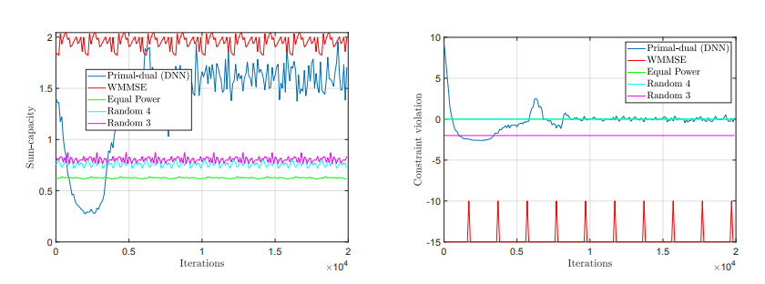

# Introduction
This post introduces some work done in collaboration with Mark Eisen about solving optimization problems of the form

$$min_\theta \text{ } E_h[l(h, f_\theta(h))] \\
s.t. E_h[g(h, f_\theta(h))] \leq 0$$

where $$l$$ is a smooth loss function, and $$g$$ is a smooth constraint function. In particular, this optimization has to be done where $$l$$ and $$g$$ may be unknown or hard to measure. This is the case for wireless power allocation. One goal is to maximize throughput while under power constraints. The throughput is affected by the environment (how the waves bounce around, other wireless interference, etc.) which can be changing over time. The characterstics of the environment can be measured, but not so easily, and it can change quite fast. Thus, Reinforcement Learning (RL) seems to be a good candidate solution. However, most Reinforcement learning algorithms do not optimize with constraints in mind. This work will extend common methods into constrained versions. Our paper is available [here](#eisen).

# Background
I am not an expert in wireless technology. So for a more complete picture, I will point you to examples in [our paper](https://arxiv.org/abs/1807.08088) that my coauthor has written. A brief summary will be that wireless transceivers have a variety of channels (frequency allocations) on which it can choose to communicate on. The channels are effected by $$h$$, the [fading](https://en.wikipedia.org/wiki/Fading). Generally, sending a more powerful signal will allow the message to be recieved with greater probability, though other transmitters might interfere as well. The goal is to allocate power to multiple transmitters across channels to maximize throughput while obeying a power constraint.

Reinforcement learning is a technique to solve [Markov Decision Processes (MDP)](https://en.wikipedia.org/wiki/Markov_decision_process) when some part of the MDP is unknown. There are many great resources for an intro into reinforcement learning such as [this book](#sutton). I will abstain from adding one more slightly worse introduction. 

# Method
We use policy gradient methods from Reinforcement Learning to find a good policy for wireless allocation. The policy is stochastic, and takes a measurement of the fading environment as input. The output is a distribution over power allocations, represented by the parameters of a truncated Gaussian.

Because we have a constrained problem, just applying policy gradient doesn't work. Instead, we look at the [dual problem](https://en.wikipedia.org/wiki/Duality_(optimization)). If you are unfamiliar with optimization and duality, this is a large topic to try to breach here. A high level overview is that optimization problems can be represented in a different (dual) form that may be easier to solve. This dual form takes the constraints of the original and puts it into the objective. The optimization is then done over Lagrange multipliers. One thing to note is that solving the dual problem is not always the same as solving the original problem. In the case of [convex problems](https://en.wikipedia.org/wiki/Convex_optimization), they are the same. This paper shows that with large enough neural networks to represent the policy, the dual problem is *almost* the same as solving the original.
The dual problem looks like this

$$max_\lambda min_\theta E_h[l(h, f_\theta(h))] + \lambda^T E_h[g(h, f_\theta(h))]\\
s.t. \lambda \geq 0 $$

There is a maximization over the Lagrange multipliers, $$\lambda$$, and a minimization over the parameters of the policy, $$\theta$$. We can treat the Lagrangian (everything within the max-min) as a reward for policy optimizaiton. We can then interleave minimizations, by taking steps with the policy gradient, with maximizations with respect to the lagrange multipliers. This way of alternating optimizations is known as a primal-dual method, and is known method in optimization.

# Results
Fig. 1 shows the results of our experiments. We simulated wireless channels with noise, and compared some strategies with the learned policy. The x axis represents time. Our policy gets better with time as it learns from the accumulated experience. The strategies compared with are 1) random allocation, 2) equal power allocation, 3) WMMSE. WWMSE is a state-of-the-art method that requires a model of the capacity function (which our method does not have access to). We can do this in simulation, because we can choose a capacity function and give it to WWMSE. The graphs show that we can obtain comparable performance to WMMSE without having to model the capacity function.

<figure display="table">
  
  <figcaption display="table-caption" caption-side="bottom"><i>Fig. 1: Results of applying our method on a wireless channel simulation. </i></figcaption>
</figure>

# Conclusion
This work shows that there is some promise in using Reinforcement Learning to optimize wireless power allocation. Since this paper's publication, Mark has [extended it to use graph neural networks](#eisen2020). 

# References

<a name="eisen" href="https://arxiv.org/abs/1807.08088" target="_blank">Eisen, Mark, et al. "Learning optimal resource allocations in wireless systems." IEEE Transactions on Signal Processing 67.10 (2019): 2775-2790.</a>

<a name="sutton" href="http://incompleteideas.net/book/the-book-2nd.html" target="_blank">Sutton, R. S., Barto, A. G. (2018 ). Reinforcement Learning: An Introduction. The MIT Press.</a>

<a name="eisen2020" href="https://arxiv.org/pdf/1909.01865.pdf" target="_blank">Eisen, Mark, and Alejandro R. Ribeiro. "Optimal wireless resource allocation with random edge graph neural networks." IEEE Transactions on Signal Processing (2020).</a>

