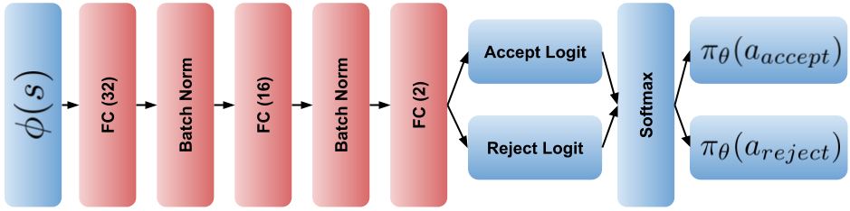
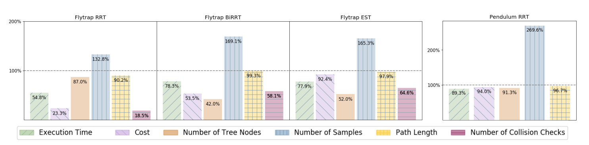
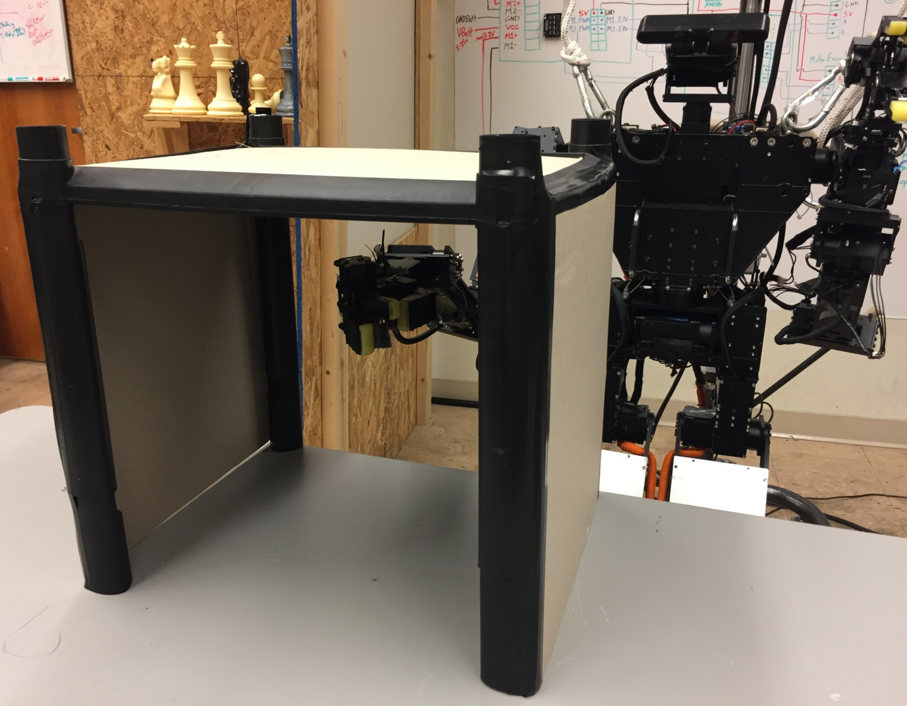
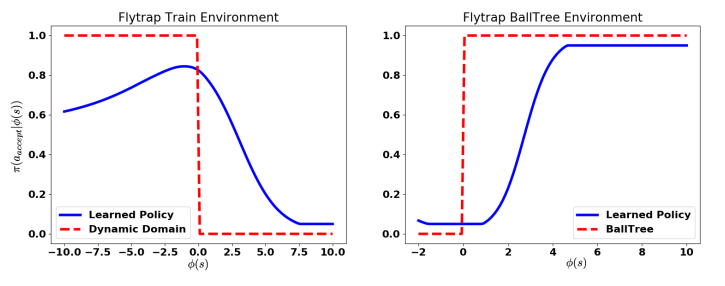
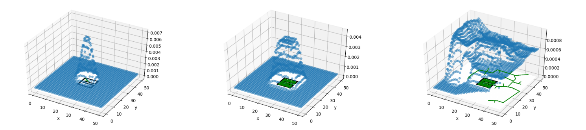

# Introduction
Robot motion planning is a problem that has been studied for many decades. For quite a while, sampling based planning approaches such as [Rapidly Exploring Random Trees (RRT)](http://msl.cs.uiuc.edu/~lavalle/papers/LavKuf01.pdf), [Expansive Space Trees (EST)](http://ftp.cs.stanford.edu/cs/robotics/dyhsu/papers/icra97.pdf), were quite popular in academia have been used with great success in some problem domains. 
This post introduces work I have done in collaboration with Jinwook Huh and Daniel D. Lee about speeding up such motion planning approaches by learning a better sampling distribution to draw from. This work is available [here](#zhang).
While many more modern planners for robots such as autonomous vehicles no longer have a basis in these sampling based planners, perhaps similar ideas in how to integrate machine learning into an existing planning framework can be useful.

# Background
We can discuss a bare-bones planning problem. You have a map of the environment that can be represented maybe as a point cloud or occupancy map or collection of polygons, or a signed distance function, etc. You have a goal state and a starting state, and you would like to find a set of actions for a robot that will take you from start to goal. 

<figure display="table">
  
  <figcaption display="table-caption" caption-side="bottom"><i>Fig. 1: An example of a planning problem. The green dot is the start, while the red is the goal.</i></figcaption>
</figure>

For sampling-based planners, the general idea is to explore a continuous state space with random samples. The prototypical sampling based planner, RRT, roughly works as follows.

1. Initialize a tree with a node that represents the starting state
2. Sample a point in the entire state space
3. Find the closest node in your tree to the sample
4. From the closest point, move towards the random sample and add the new state as a node in the tree
5. Repeat steps 2-4 until the goal is included in the tree.

This process will grow the tree to cover the space and hopefully find a path from the start to the goal. You can check out [Steven LaValle's website](http://lavalle.pl/rrt/gallery_2drrt.html) (The guy who invented RRT's) for cool pictures of RRT in action and what it looks like while the algorithm is running.

For these sampling based planners, Step 2 in the algorithm can be quite important. It is what will guide how the tree searches the environment (if you are familiar with A* and its many variants, the sampling distribution plays a similar role to the heuristic function). Typically, a uniform distribution with a slight goal bias (with some chance, choose the goal as the random sample) is used. There have been many efforts to come up with better sampling techniques including using the [medial axis](#yang2004), [visibility](#yershova2005), or [volumes](#shkolnik2011). These are all heuristics that hopefully are better distributions to sample from than the uniform distribution.

A natural question arises, can we learn more general heuristics for common classes of planning problems? For example, if we are using a robot arm to manipulate objects on a table, we might be able to exploit some of the structure of the problem to speed up our search. This heuristic may be different if you are talking about a robot navigating an office space, or an autonomous vehicle navigating around a city. And it would be great to use data from planning in those different environments to learn good sample distribution.

# Method
To learn a sampling distribution, we must first be able to represent a sampling distribution. In this case, we have chosen to represent it implicitly (thus the title of the paper) with rejection sampling. That is, given some simple distribution that you can easily draw samples from (uniform with goal bias), assign a probability of rejecting that sample. Then when you are sampling from this implicitly defined distribution, you will draw samples from the original distribution and with some probability, reject on those samples. This will define a new distribution that can look quite different from the original distribution with out rejecting any samples.

In this particular case, we use a small (tiny by modern standards) neural network to process some features of a sample drawn. The output of the neural network is a probability to accept or reject.

<figure display="table">
  
  <figcaption display="table-caption" caption-side="bottom"><i>Fig. 2: A tiny neural network.</i></figcaption>
</figure>

We can then view the process of accepting and rejecting samples to pass to the planner as a [Markov Decision Process (MDP)](https://en.wikipedia.org/wiki/Markov_decision_process) where the state is the state of the planner with a new random sample, and the actions are to reject or accept it. The rewards are chosen to reward finding a path faster. This process can be optimized with some standard Reinforcement Learning (RL) techniques. There are a great many tutorials and introductions to RL, so I will abstain from adding one more slightly worse introduction. I highly recommend [this book by Sutton](#sutton) as a good introductory read. For our purpoes, we will use a simple policy gradient method to optimize our rejection "policy."

# Results
This methodology is applied to several environments and algorithms and the results are shown in Fig. 3. In addition to RRT, you can apply this rejection sampling technique to any other sampling-based planner such as Bi-RRT or EST, etc. The flytrap environment refers to Fig. 1, while Pendulum referes to an inverted pendulum.

<figure display="table">
  
  <figcaption display="table-caption" caption-side="bottom"><i>Fig. 3: Results in simulation.</i></figcaption>
</figure>

We also applied this to a robot arm in real life. 

<figure display="table">
  
  <figcaption display="table-caption" caption-side="bottom"><i>Fig. 4: Thor's robot arm.</i></figcaption>
</figure>

<figure display="table">
  
  <figcaption display="table-caption" caption-side="bottom"><i>Fig. 5: Results on a robot arm.</i></figcaption>
</figure>

In these cases, the new sampling distribution can reduce the number of collision checks by rejecting samples that are highly likely to induce them as well as reducing overall execution time.

It is also interesting to look at the learned rejection policies more closely. For the flytrap environment, good rejection policies actually depend on the size of the flytrap relative to the environment. The [visibility](#yershova2005) based heuristic works when the flytrap is small, and the [volume](#shkolnik2011) based heuristic works when the flytrap is big. When running the rejection policy optimization over small and big flytrap environments, it actually obtains very similar heuristics to the human created ones.

<figure display="table">
  
  <figcaption display="table-caption" caption-side="bottom"><i>Fig. 6: Learned rejection policies vs. human heuristics. Flytrap train refers to the small flytrap, dynamic-domain refers to the visibility heuristic, flytrap-balltree refers to the big flytrap, and BallTree refers to the volume based heuristic.</i></figcaption>
</figure>

<figure display="table">
  
  <figcaption display="table-caption" caption-side="bottom"><i>Fig. 7: Cool sampling distributions in action on the flytrap environment.</i></figcaption>
</figure>

For the robotic arm, when we look at the learned distribution, the samples that are further away from the table are rejected more often. For the task of moving objects around, it is wasteful to explore random configurations that bring the arm way over or away from the objects. 

# Conclusion
This work had the goal to unify the understanding of how a lot of previous sampling heuristics worked. Many use rejection sampling, and Reinforcement Learning can be applied to optimize that rejection sampling so as to automate the process of finding heuristics. There are some interesting tangents to discuss. For example, if an optimal planner is available (RRT* and friends), instead of using RL to optimize rejection policies, supervised learning can be used instead. With supervision, the policies can be learned faster, and perhaps, we can obtain even better policies. For complicated environments, however, RRT* can take very long to run. It can be interesting to start with RL and move to supervised learning as our heuristics get better and we can find near-optimal policies. Since this paper's publication, there has been interesting work in learning [heurstics for A*](#zlatan2019), as well as [generative sampling distributions](#ichter2018).

# References

<a name="zhang" href="https://arxiv.org/pdf/1806.01968.pdf" target="_blank">Zhang, Clark, Jinwook Huh, and Daniel D. Lee. "Learning implicit sampling distributions for motion planning." 2018 IEEE/RSJ International Conference on Intelligent Robots and Systems (IROS). IEEE, 2018.</a>

<a name="yang2004" href="https://citeseerx.ist.psu.edu/viewdoc/download?doi=10.1.1.4.8254&rep=rep1&type=pdf" target="_blank">Y. Yang and O. Brock, “Adapting the sampling distribution in prm
planners based on an approximated medial axis,” in Robotics and
Automation, 2004. Proceedings. ICRA’04. 2004 IEEE International
Conference on, vol. 5, pp. 4405–4410, IEEE, 2004.</a>

<a name="yershova2005" href="http://citeseerx.ist.psu.edu/viewdoc/download?doi=10.1.1.60.5751&rep=rep1&type=pdf" target="_blank">A. Yershova, L. Jaillet, T. Siméon, and S. M. LaValle, “Dynamic-
domain rrts: Efficient exploration by controlling the sampling domain,”
in Robotics and Automation, 2005. ICRA 2005. Proceedings of the
2005 IEEE International Conference on, pp. 3856–3861, IEEE, 2005.</a>

<a name="shkolnik2011" href="https://arxiv.org/pdf/1109.3145.pdf" target="_blank">A. Shkolnik and R. Tedrake, “Sample-based planning with volumes
in configuration space,” arXiv preprint arXiv:1109.3145, 2011.</a>

<a name="sutton" href="http://incompleteideas.net/book/the-book-2nd.html" target="_blank">Sutton, R. S., Barto, A. G. (2018 ). Reinforcement Learning: An Introduction. The MIT Press.</a>

<a name="zlatan2019" href="https://arxiv.org/pdf/1906.02789.pdf" target="_blank">Zlatan Ajanovic, Halil Beglerovic, Bakir Lacevic. "A novel approach to model exploration for value function learning." RSS 2019 workshop. </a>

<a name="ichter2018" href="https://arxiv.org/pdf/1709.05448.pdf" target="_blank">Ichter, Brian, James Harrison, and Marco Pavone. "Learning sampling distributions for robot motion planning." 2018 IEEE International Conference on Robotics and Automation (ICRA). IEEE, 2018.</a>

