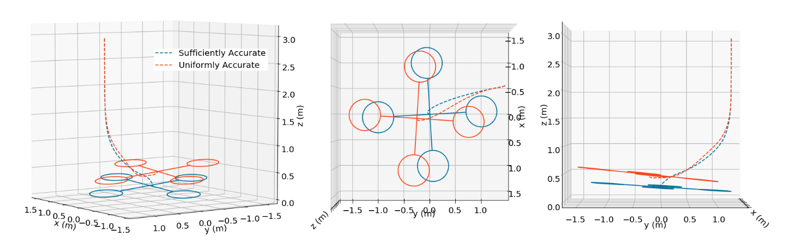

# Introduction
This work looks at learning dynamics model for planning and control. Planners require a model of the system to work with. This model will inform the planner what happens when you take an action at some specific state. In <a href="../learning_implicit"> previous work </a>, we had applied machine learning to learn heuristics for planning. This work addresses learning the model for planning. A paper containing some results is available [here](#zhang2021). 

# Background
Planners require a model of the world that will tell us how it will evolve with certain actions. This can be expressed as a differential equation

$$\dot{x} = f(x, u)$$

or as a discrete time function

$$x_{k+1} = f(x_k, u_k)$$ 

This work will be using discrete time functions, but the ideas are more generally applicable.
Many modern planners will formulate the problem as a nonlinear optimization problem, and solve it with general purpose or more specialized solvers. Examples include [CHOMP](#zucker2013), [TrajOpt](#schulman2013), or [iLQG](#todorov2005). An advantage these planners have over sampling based (such as RRT) or search based (such as A*) planners are that they perform quite admirably in high dimensions and converge quickly to locally optimal solutions. These optimization planners only work in "relatively" simple environments. Problems where finding the solution might require a search through many homotopy classes are difficult for this class of optimization based planners. They require a decent initialization. But, as it turns out, for many real world situations, planning is more akin to optimizing a general idea of what to do, rather than solving a complicated maze.

One can try to use data to obtain a better model for planning  with these optimization based planners. Usually the constraints on the model are that they have to be differentiable. Using a neural network to represent these models fits this constraint quite well. By using data to tune or learn your model, you can have a more accurate picture of what your system looks like and adapt to any physical changes it undergoes. Maybe the wheel of a car becomes more smooth over time, or a motor in a robot arm becomes less powerful. By using data, the planners can adapt to these changes in a more active way. 

There is a vast literature on model learning. In controls, there is a huge trove of "System Identification" papers which mostly focus on learning linear systems. In robotics, there are many methods that fit Gaussian Process Regression models, or Gaussian Mixture Models, or Neural Networks, or linear models to various systems. This paper presents not a new method, but a new objective for which these methods can use. Most of these methods will simply seek to minimize an error between an observed next state, $$x_{k+1}$$ with that the predicted next state, $$\hat{x}_{k+1}$$. This results in a loss functions that look like

$$ \mathbb{E} || x_{k+1} - f_\theta(x_k, u_k) ||_2^2$$

where $$f_\theta$$ is the learned model.

# Method
Our work proposes that we can solve a constrained problem instead of simply minimizing an unconstrained objective. The constraints can contain prior information about the system, and solving the constrained problem can then lead to models better suited for planners.
An simple example is suppose we have a block we are pushing on a table, that has lot of uneven surfaces. Suppose we want to push the block from various points to a common resting location. We can learn a model that is uniformly accurate everywhere. Or, we can learn a model that is selectively good near the goal location. Because far away from the goal, the plan is simple, we push in the direction of the goal. It is only when we are near the goal we care about how much we push so that the block comes to a stop efficiently and correctly. This prior knowledge can be summarized as a constraint on the accuracy near the goal. We can write a constrained problem that looks like

$$ min_\theta \mathbb{E} f(x_k, u_k, x_{k+1})\\
s.t. \mathbb{E} g(x_k, u_k, x_{k+1}) \leq 0$$

We have explored solving constrained problems <a href="/2018/09/09/constrained_wireless"> before </a>. In this case, we expand the theory somewhat. We can no longer analytically compute the expectations in the constrained problem and can only use samples of data. This is because the distribution of trajectories for a system is very complicated. This paper shows that you can still obtain [small duality gaps](https://en.wikipedia.org/wiki/Duality_gap) with large enough models and large enough numbers of samples.

Similar to <a href="/2018/09/09/constrained_wireless"> our previous work </a>, we can use a primal-dual method to solve this. We alternatively minimize the Lagrangian, and maximize the dual variables.

# Results
Using some constrained objectives, we can obtain models so that the planner can do better on average. We have tested this in simulation on a state-dependent-friction block pushing task, a ball bouncing task, and a quadrotor landing task. Numerical results show that we can trade off accuracy in unimportant parts of the statespace for better accuracy in others, and obtain better performing planners. The detailed results are under submission right now. But to highlight a few instances for why this is better, we can look at the quadrotor landing. Our constraint is that the model should be more accurate close to the ground. This is where ground effects are most prominant and require greater precision in the model.

<figure display="table">
  
  <figcaption display="table-caption" caption-side="bottom"><i>Fig. 1: Quadrotor trajectories.</i></figcaption>
</figure>

A model learned using our objective is better able to compensate for the greater updraft near the ground when landing and can get to the location more accurately.

# References

<a name="zhang2021" href="https://arxiv.org/pdf/2102.06099.pdf" target="_blank">Zhang, Clark, and Paternain, Santiago, & Ribeiro, Alejandro. Sufficiently Accurate Model Learning for Planning. 2021.</a>

<a name="zucker2013" href="https://www.ri.cmu.edu/pub_files/2013/5/CHOMP_IJRR.pdf" target="_blank">Zucker, Matt, et al. "Chomp: Covariant hamiltonian optimization for motion planning." The International Journal of Robotics Research 32.9-10 (2013): 1164-1193.
</a>

<a name="schulman2013" href="http://citeseerx.ist.psu.edu/viewdoc/download?doi=10.1.1.387.4642&rep=rep1&type=pdf" target="_blank">Schulman, John, et al. "Finding Locally Optimal, Collision-Free Trajectories with Sequential Convex Optimization." Robotics: science and systems. Vol. 9. No. 1. 2013.<
/a>

<a name="todorov2005" href="http://maeresearch.ucsd.edu/skelton/publications/weiwei_ilqg_CDC43.pdf" target="_blank">Todorov, Emanuel, and Weiwei Li. "A generalized iterative LQG method for locally-optimal feedback control of constrained nonlinear stochastic systems." Proceedings of the 2005, American Control Conference, 2005.. IEEE, 2005.
</a>

